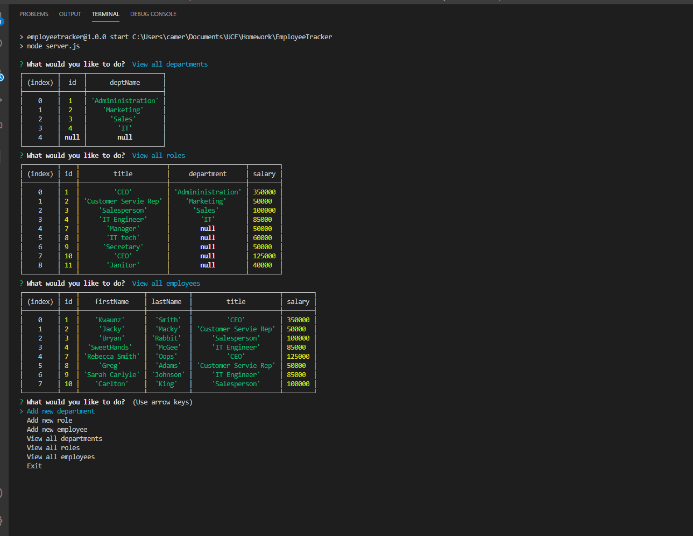

 # Project Name  
  Employee Tracker

  ## Overview 
  A solution for managing a company's employees by role, department, along with salary info using node, inquirer, and MySQL.

  ## Table of Contents:
  - [Links](#Links)
  - [Screenshots_and_GIFs](#Screenshots_and_GIFs)
  - [Usage](#Motivation)
  - [Installation](#Installation)
  - [How_to_use](#How_to_use)
  - [License](#License)
  - [Contribute](#Contribute)

  ## Links
  - (https://camerong88.github.io/EmployeeTracker/)
  - (https://github.com/CameronG88/EmployeeTracker)

  ## Screenshots_and _Vids

  - 
  - 

  ## Usage
As an executvie or business owner I want to quickly create a database to store and manage employee credentials as well as view company role and department specific information. 

  ## Installation   
  Required installations to run this program:
  - DBeaver
  - MySQL  
  - Express
  - Inquirer
  - JavScript
  - Node.Js

  ## How_to_Use
After you make sure you have all the dependencies, run the code 'npm run start' in terminal to generate the initial prompt. Select the action you would like to take and follow the prompts to create your employee database.

  ## License      
  MIT
 
 ## Credits
  John Dinsmore, Jorge Alvarez

  ## Contribute
 You can contribute by committing or commentting to the project in github using the link above.

  © Copyright 2020

  